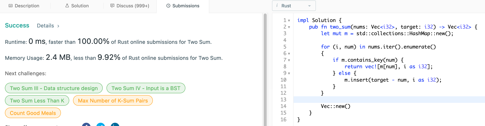
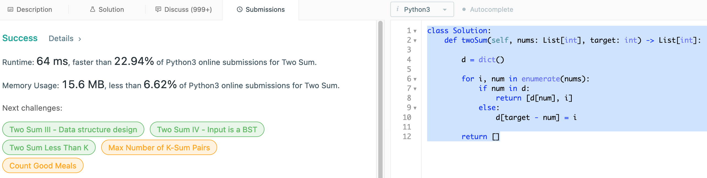

# 1. Two Sum

## Question

Given an array of integers nums and an integer target, return indices of the
two numbers such that they add up to target.

You may assume that each input would have exactly one solution, and you may not
use the same element twice.

You can return the answer in any order.

## Approach

Naive approach here would be to use brute force - perform exhaustive comparison
between every element against every other element. This algorithm involves
nested loops that we be O(n^2) in time complexity, but linear in space.

Improvement can be made by first sorting the array of integers in order such
that we can use two pointers starting at either end of the array: left pointer
would be the smallest, and right pointer would be largest. With this method, we
can find the two numbers that add up to target in linear time. However, since
we have to perform the sorting beforehand, the overall time complexity would be
O(n * log(n)).

To achieve O(n) in time complexity, we look to trade off space - by using O(n)
space to store information about previously seen elements, we can make the
improvement. Here, we use hashmap to store the previous seen elements as key
and its index as value.


## Implementation

Rust:

```rust
impl Solution 
{
    pub fn two_sum(nums: Vec<i32>, target: i32) -> Vec<i32> 
    {
        let mut m = std::collections::HashMap::new();
        
        for (i, num) in nums.iter().enumerate() 
        {
            if m.contains_key(num) { 
                return vec![m[num], i as i32];
            } else {
                m.insert(target - num, i as i32);
            }
        }
        
        Vec::new()
    }
}
```



Python3:

```python
class Solution:
    def twoSum(self, nums: List[int], target: int) -> List[int]:
        
        d = dict()
        
        for i, num in enumerate(nums):
            if num in d:
                return [d[num], i]
            else:
                d[target - num] = i
        
        return []
```


