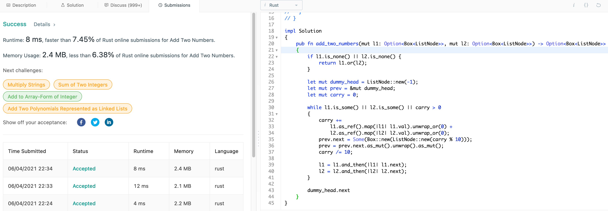
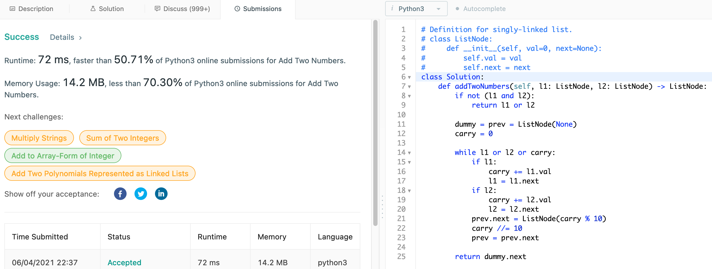

# 2. Add Two Numbers

## Question

You are given two non-empty linked lists representing two non-negative
integers. The digits are stored in reverse order, and each of their nodes
contains a single digit. Add the two numbers and return the sum as a linked
list.

You may assume the two numbers do not contain any leading zero, except the
number 0 itself.

## Approach

There are multiple approaches to this problem but two most simple solution
would be as follows:

1. Iterate on both of the given linked lists and convert them into number type.
   Perform addition operation as most langauges should support it and build
   a linked list out of the resulting solution to return.

2. Iterate on both of the given linked lists and perform the addition for
   current digit while we build the new linked list.

In either of two cases, the time complexity would be same, O(n). The difference
is that first approach would require two-pass; one to interpret the linked list
into numbers and finally to build the result linked list.

## Implementation

Rust:

Review more on the `Option<T>` and `Box<T>`.

```rust
impl Solution 
{    
    pub fn add_two_numbers(mut l1: Option<Box<ListNode>>, mut l2: Option<Box<ListNode>>) -> Option<Box<ListNode>> 
    {
        // if either list is None or both are None, then return whichever is present
        // using == operator is potentially unsafe as Option<T> has to impl PartialEq trait
        // use is_none() instead
        if l1.is_none() || l2.is_none() { 
            return l1.or(l2);
        }
        
        let mut dummy_head = ListNode::new(-1);
        let mut prev = &mut dummy_head;
        let mut carry = 0;
        
        while l1.is_some() || l2.is_some() || carry > 0
        {
            carry +=
                l1.as_ref().map(|l1| l1.val).unwrap_or(0) +
                l2.as_ref().map(|l2| l2.val).unwrap_or(0);
            prev.next = Some(Box::new(ListNode::new(carry % 10)));
            prev = prev.next.as_mut().unwrap().as_mut();
            carry /= 10;
            
            l1 = l1.and_then(|l1| l1.next);
            l2 = l2.and_then(|l2| l2.next);
        }
        
        dummy_head.next
    }
}
```



Python3:

```python
class Solution:
    def addTwoNumbers(self, l1: ListNode, l2: ListNode) -> ListNode:
        if not (l1 and l2):
            return l1 or l2
        
        dummy = prev = ListNode(None)
        carry = 0
        
        while l1 or l2 or carry:
            if l1:
                carry += l1.val
                l1 = l1.next
            if l2:
                carry += l2.val
                l2 = l2.next
            prev.next = ListNode(carry % 10)
            carry //= 10
            prev = prev.next
        
        return dummy.next
```



