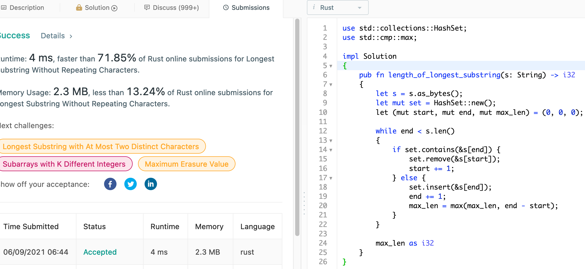
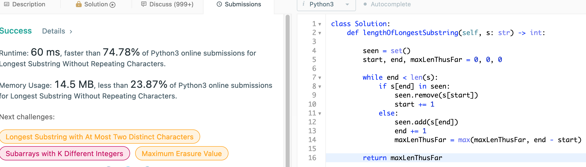

# 3. Longest Substring Without Repeating Characters

## Question

Given a string s, find the length of the longest substring without repeating characters.

## Approach

Naive approach here would be to use brute force - generate all possible substrings to see which one is the longest non-repeating substring.

Better approach here would be to use a set to maintain the characters that we have for current substring that we are building. So long as the new character is found to be non-conflicting (has not been seen yet), then we can safely add to our set. Otherwise, we remove whilst shrink the front of our window. This would be O(n) in both time and space complexity.

## Implementation

Rust:

```rust
use std::collections::HashSet;
use std::cmp::max;

impl Solution 
{
    pub fn length_of_longest_substring(s: String) -> i32 
    {
        let s = s.as_bytes();
        let mut set = HashSet::new();
        let (mut start, mut end, mut max_len) = (0, 0, 0);
        
        while end < s.len()
        {
            if set.contains(&s[end]) {
                set.remove(&s[start]);
                start += 1;
            } else {
                set.insert(&s[end]);
                end += 1;
                max_len = max(max_len, end - start);
            }
        }
        
        max_len as i32
    }
}
```



Python3:

```python
class Solution:
    def lengthOfLongestSubstring(self, s: str) -> int:
        
        seen = set()
        start, end, maxLenThusFar = 0, 0, 0
        
        while end < len(s):
            if s[end] in seen:
                seen.remove(s[start])
                start += 1
            else:
                seen.add(s[end])
                end += 1
                maxLenThusFar = max(maxLenThusFar, end - start)
        
        return maxLenThusFar
```


