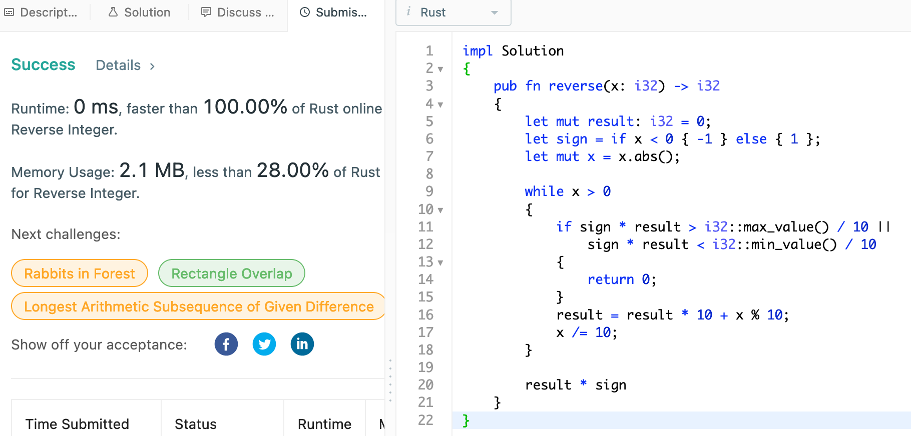
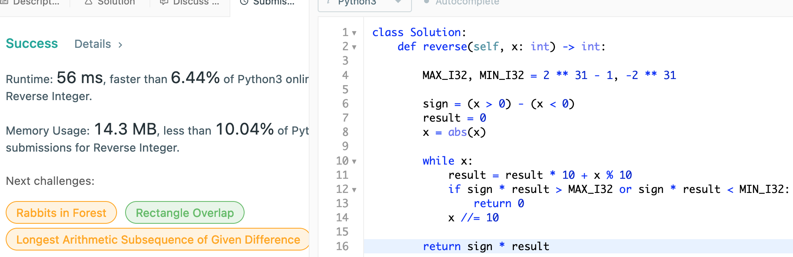

# 7. Reverse Integer

## Question

Given a signed 32-bit integer x, return x with its digits reversed. If reversing x causes the value to go outside the signed 32-bit integer range [-2^31, 2^31 - 1], then return 0.

*Assume the environment does not allow you to store 64-bit integers (signed or unsigned).*

## Approach

Simply we extract the given integer digit by digit from the end using modulo operation, and build our reversed result.

The exceptional cases to watch out for would be to check for the overflow/underflow as well as checking for the initial sign of the given integer.

As the input is limited to 32-bit integer, we are guranteed to run this within O(1) time complexity.

## Implementation

Rust:

Note that we could have used `checked_add()` to see whether integer have overflown.

```rust
impl Solution 
{
    pub fn reverse(x: i32) -> i32 
    {
        let mut result: i32 = 0;
        let sign = if x < 0 { -1 } else { 1 };
        let mut x = x.abs();
        
        while x > 0
        {
            if sign * result > i32::max_value() / 10 ||
                sign * result < i32::min_value() / 10 
            {
                return 0;
            }
            result = result * 10 + x % 10;
            x /= 10;
        }
        
        result * sign
    }
}
```



Python3:

```python
class Solution:
    def reverse(self, x: int) -> int:

        MAX_I32, MIN_I32 = 2 ** 31 - 1, -2 ** 31
        
        sign = (x > 0) - (x < 0)
        result = 0
        x = abs(x)
        
        while x:
            result = result * 10 + x % 10
            if sign * result > MAX_I32 or sign * result < MIN_I32:
                return 0
            x //= 10
        
        return sign * result
```


