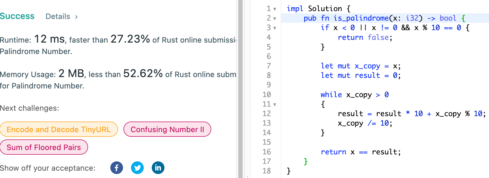
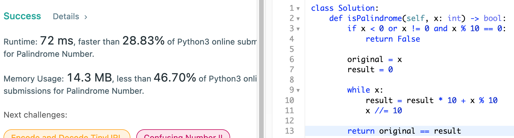

# 9. Palindrome Number

## Question

Given an integer x, return true if x is palindrome integer.

An integer is a palindrome when it reads the same backward as forward. For example, 121 is palindrome while 123 is not.

## Approach

This question ties in with #7 Reverse Integer - in that we can simply reverse the given integer, and compare the original with reversed integer. This process would not take more than O(1) as the size of int should be limited to size of int defined by the system or the language; but it should be constant. There is a neat trick in comparison in that we can filter out negative inputs as well as those that end in `0`s.

Another approach that we can think of would be to simply convert into string and reverse. Ironically, this would be just as good as above approach so long as type conversion is not too much of an overhead.

## Implementation

Rust:

Two Approaches shown here - using string conversion and integer reversal.

```rust
impl Solution 
{
    pub fn is_palindrome1(x: i32) -> bool 
    {
        // i32 -> string -> chars array conversion
        return x.to_string().chars().rev().eq(x.to_string().chars());
    }
    
    pub fn is_palindrome2(x: i32) -> bool 
    {
        // integer reversal
        if x < 0 || x != 0 && x % 10 == 0 {
            return false;
        }
        
        let mut x_copy = x;
        let mut result = 0;
        
        while x_copy > 0 
        {
            result = result * 10 + x_copy % 10;
            x_copy /= 10;
        }
        
        return x == result;
    }
}
```



Python3:

```python
class Solution:

    def isPalindrome(self, x: int) -> bool:

        if x < 0 or x != 0 and x % 10 == 0:
            return False
        
        original = x
        result = 0
        
        while x:
            result = result * 10 + x % 10
            x //= 10
        
        return original == result
```


