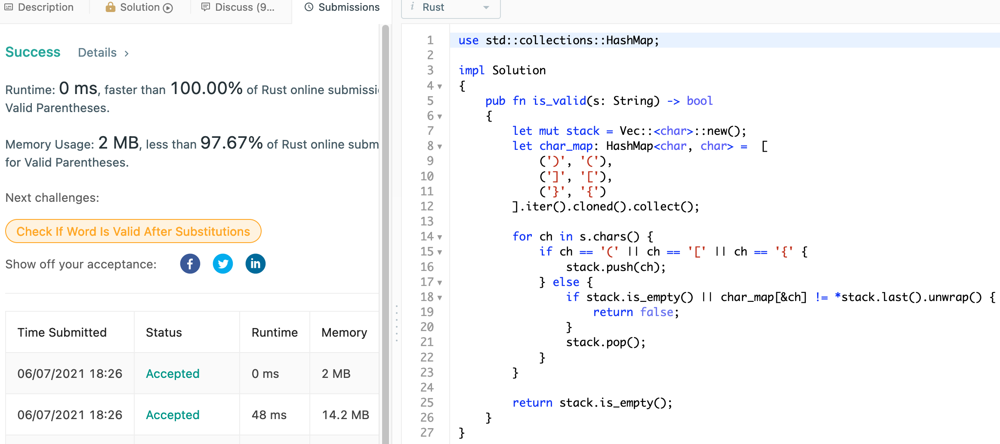
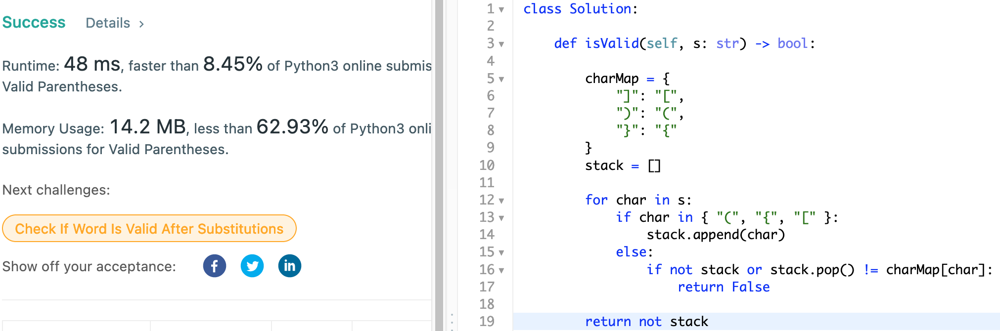

# 20. Valid Parentheses

## Question

Given a string s containing just the characters '(', ')', '{', '}', '[' and ']', determine if the input string is valid.

An input string is valid if:

    Open brackets must be closed by the same type of brackets.
    Open brackets must be closed in the correct order.

## Approach

The problem can be easily solved using a stack data structure. For each encountered _open_ parenthesis, we push unto the stack. Then, for each encountered _closed_ parenthesis, we check against the top of our stack as there should be the matching _open_ parenthesis in order. This approach would be O(n) in both time and space complexity.

## Implementaion

Rust:

```rust
use std::collections::HashMap;

impl Solution 
{    
    pub fn is_valid(s: String) -> bool 
    {
        let mut stack = Vec::<char>::new();
        let char_map: HashMap<char, char> = [
            (')', '('),
            (']', '['),
            ('}', '{')
        ].iter().cloned().collect();
        
        for ch in s.chars() 
        {
            if ch == '(' || ch == '[' || ch == '{' {
                stack.push(ch);   
            } else {
                // Option<char> is guranteed as we first check for emptiness
                if stack.is_empty() || char_map[&ch] != *stack.last().unwrap() {
                    return false;
                }
                stack.pop();
            }
        }
        
        return stack.is_empty();
    }
}
```



Python3:

```python
class Solution:
    
    def isValid(self, s: str) -> bool:
        
        charMap = {
            "]": "[",
            ")": "(",
            "}": "{"
        }
        stack = []
        
        for char in s:
            if char in { "(", "{", "[" }:
                stack.append(char)
            else:
                if not stack or stack.pop() != charMap[char]:
                    return False
        
        return not stack
```


