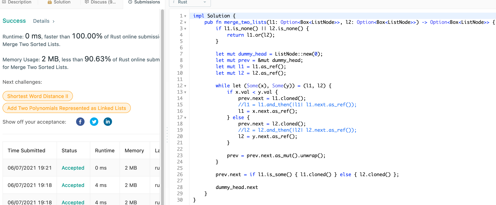
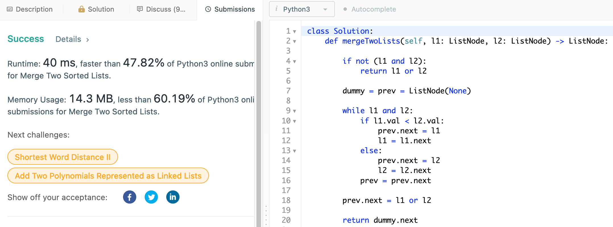

# 21. Merge Two Sorted Lists

## Question

Merge two sorted linked lists and return it as a sorted list. The list should be made by splicing together the nodes of the first two lists.

## Approach

This would be O(n + m) in time complexity in iterating on both of the lists and comparing their current values to append to the new combined list.

## Implementation

Rust:

```rust
impl Solution 
{
    pub fn merge_two_lists(l1: Option<Box<ListNode>>, l2: Option<Box<ListNode>>) 
        -> Option<Box<ListNode>> 
    {
        if l1.is_none() || l2.is_none() {
            return l1.or(l2);
        }
        
        let mut dummy_head = ListNode::new(0);
        let mut prev = &mut dummy_head;
        let mut l1 = l1.as_ref();
        let mut l2 = l2.as_ref();
        
        // while both l1 and l2 are Some<...>
        while let (Some(x), Some(y)) = (l1, l2) {
            if x.val < y.val {
                prev.next = l1.cloned();
                //l1 = l1.and_then(|l1| l1.next.as_ref());
                l1 = x.next.as_ref();
            } else {
                prev.next = l2.cloned();
                //l2 = l2.and_then(|l2| l2.next.as_ref());
                l2 = y.next.as_ref();
            }
            
            prev = prev.next.as_mut().unwrap();
        }
        
        // append whichever is leftover from either list 
        prev.next = if l1.is_some() { l1.cloned() } else { l2.cloned() };
        
        dummy_head.next
    }
}
```



Python3:

```python3
class Solution:
    def mergeTwoLists(self, l1: ListNode, l2: ListNode) -> ListNode:
        
        if not (l1 and l2):
            return l1 or l2
        
        dummy = prev = ListNode(None)
        
        while l1 and l2:
            if l1.val < l2.val:
                prev.next = l1
                l1 = l1.next
            else:
                prev.next = l2
                l2 = l2.next
            prev = prev.next
        
        prev.next = l1 or l2
        
        return dummy.next
```


