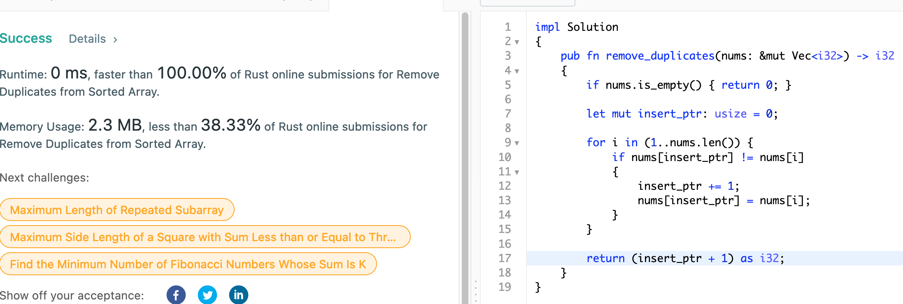
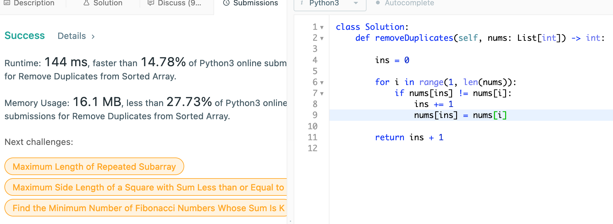

# 26. Remove Duplciates from Sorted Array

## Question

Given a sorted array nums, remove the duplicates in-place such that each element appears only once and returns the new length.

Do not allocate extra space for another array, you must do this by modifying the input array in-place with O(1) extra memory.

Clarification:

Confused why the returned value is an integer but your answer is an array?

Note that the input array is passed in by reference, which means a modification to the input array will be known to the caller as well.

## Approach

Since we are to work on the same sorted array, one approach would be to read through once and record the unique element; then move over the elements back into the original array. This would be O(n) in both time and space complexity.

However, we can work within the same array without the need for extra O(n) space so long as we can maintain the last insertion index - as we iterate forward, we move the element over to the insertion index iff the elements are different and increment the insertion index forward.

## Implementation

Rust:

```rust
impl Solution 
{
    pub fn remove_duplicates(nums: &mut Vec<i32>) -> i32 
    {
        // edge case
        if nums.is_empty() { return 0; }
        
        let mut insert_ptr: usize = 0;
        
        for i in (1..nums.len()) {
            if nums[insert_ptr] != nums[i] 
            {
                insert_ptr += 1;
                nums[insert_ptr] = nums[i];
            }
        }
        
        return (insert_ptr + 1) as i32;
    }
}
```



Python3:

```python
class Solution:
    def removeDuplicates(self, nums: List[int]) -> int:
        
        ins = 0
        
        for i in range(1, len(nums)):
            if nums[ins] != nums[i]:
                ins += 1
                nums[ins] = nums[i]
        
        return ins + 1
```


