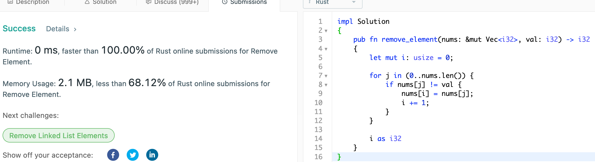
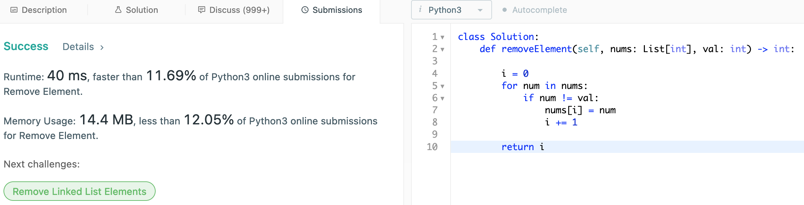

# 27. Remove Element

## Question

Given an array nums and a value val, remove all instances of that value in-place and return the new length.

Do not allocate extra space for another array, you must do this by modifying the input array in-place with O(1) extra memory.

The order of elements can be changed. It doesn't matter what you leave beyond the new length.

Clarification:

Confused why the returned value is an integer but your answer is an array?

Note that the input array is passed in by reference, which means a modification to the input array will be known to the caller as well.

## Approach

Similar approach to the question #26 in that we maintain an insertion pointer. We move over the element as we iterate on the given array to the insertion pointer so long as it is not same as the given value to eliminate. O(n) in time complexity and O(1) in space complexity.

## Implementation

Rust:

```rust
impl Solution 
{
    pub fn remove_element(nums: &mut Vec<i32>, val: i32) -> i32 
    {
        let mut i: usize = 0;
        
        for j in (0..nums.len()) {
            if nums[j] != val {
                nums[i] = nums[j];
                i += 1;
            }
        }

        i as i32
    }
}
```



Python3:

```python
class Solution:
    def removeElement(self, nums: List[int], val: int) -> int:
        
        i = 0
        for num in nums:
            if num != val:
                nums[i] = num
                i += 1
        
        return i
```


