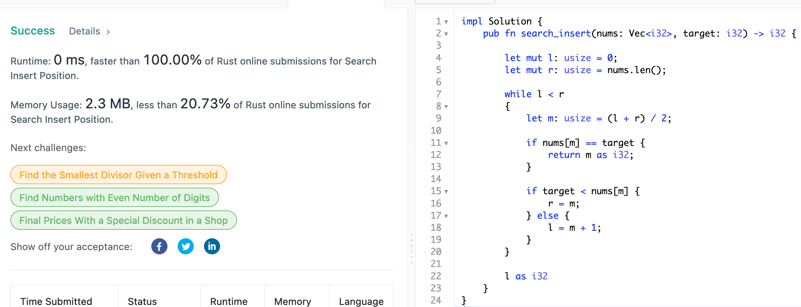

# 35. Search Insert Position

## Question

Given a sorted array of distinct integers and a target value, return the index if the target is found. If not, return the index where it would be if it were inserted in order.

You must write an algorithm with O(log n) runtime complexity.

## Approach

Since the array is already in the sorted order, we can utilize binary search algorithm to find the element - if not found return the last index found which would be its insertion point.

## Implementation

Rust:

```rust
impl Solution 
{
    pub fn search_insert(nums: Vec<i32>, target: i32) -> i32 
    {
        let mut l: usize = 0;
        let mut r: usize = nums.len();
        
        while l < r
        {
            let m: usize = (l + r) / 2;
            
            if nums[m] == target {
                return m as i32;
            }
            
            if target < nums[m] {
                r = m;
            } else {
                l = m + 1;
            }
        }
        
        l as i32
    }
}
```



Python3:

```python
class Solution:
    def searchInsert(self, nums: List[int], target: int) -> int:
        
        l, r = 0, len(nums) - 1
        
        while l <= r:
            
            mid = l + (r - l) // 2
            
            if nums[mid] == target:
                return mid
            
            if nums[mid] < target:
                l = mid + 1
            else:
                r = mid - 1
        
        return l
```

