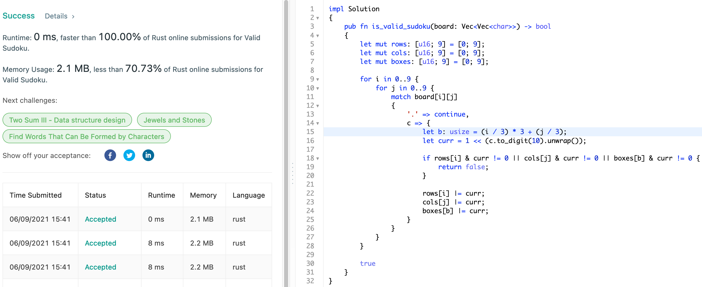
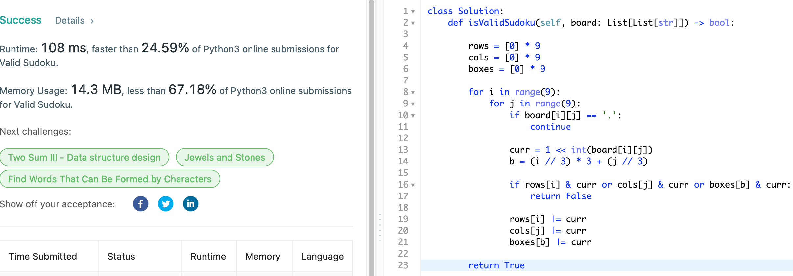

# 36. Valid Sudoku

## Question

Determine if a 9 x 9 Sudoku board is valid. Only the filled cells need to be validated according to the following rules:

    Each row must contain the digits 1-9 without repetition.
    Each column must contain the digits 1-9 without repetition.
    Each of the nine 3 x 3 sub-boxes of the grid must contain the digits 1-9 without repetition.

Note:

    A Sudoku board (partially filled) could be valid but is not necessarily solvable.
    Only the filled cells need to be validated according to the mentioned rules.

## Approach

We do not have to solve the given board to determine whether it is a valid or not. Only requirement is that it should follow the three simple rules - there should not be a duplicate value within rows, columns, and sub-boxes.

Hence, simple approach would be to use HashSet to check whether the entry is contained in the set within O(1) time complexity. If we want to save more time/space, then we can consider instead using `u16` type to represent all values from 1 to 9 and check via bit-manipulation.

## Implementation

Rust:

```rust
impl Solution 
{
    pub fn is_valid_sudoku(board: Vec<Vec<char>>) -> bool 
    {
        let mut rows: [u16; 9] = [0; 9];
        let mut cols: [u16; 9] = [0; 9];
        let mut boxes: [u16; 9] = [0; 9];
        
        for i in 0..9 {
            for j in 0..9 {
                match board[i][j] 
                {
                    '.' => continue,
                    c => {
                        let b: usize = (i / 3) * 3 + (j / 3);
                        let curr = 1 << (c.to_digit(10).unwrap());
                        
                        if rows[i] & curr != 0 || cols[j] & curr != 0 || boxes[b] & curr != 0 {
                            return false;
                        }
    
                        rows[i] |= curr;
                        cols[j] |= curr;
                        boxes[b] |= curr;
                    }
                }
            }
        }
        
        true
    }
}
```



Python3:

```python
class Solution:
    def isValidSudoku(self, board: List[List[str]]) -> bool:
        
        rows = [0] * 9
        cols = [0] * 9
        boxes = [0] * 9
        
        for i in range(9):
            for j in range(9):
                if board[i][j] == '.':
                    continue
                    
                curr = 1 << int(board[i][j])
                b = (i // 3) * 3 + (j // 3)
                
                if rows[i] & curr or cols[j] & curr or boxes[b] & curr:
                    return False
                
                rows[i] |= curr
                cols[j] |= curr
                boxes[b] |= curr
        
        return True
```


