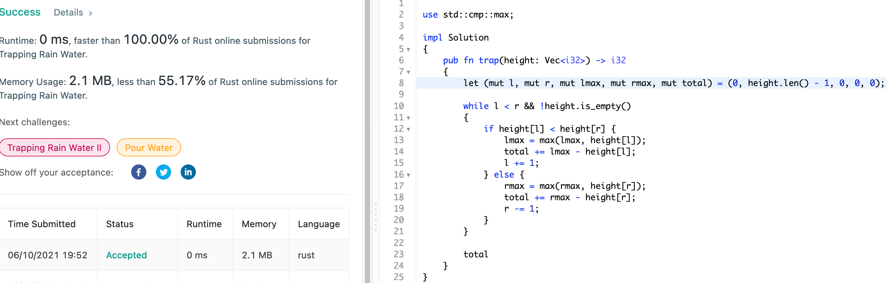
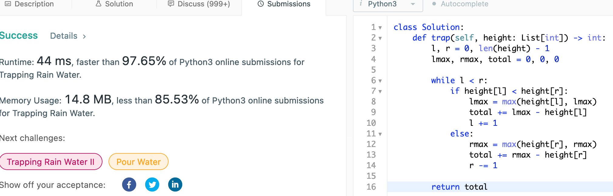

# 42. Trapping Rain Water

Given n non-negative integers representing an elevation map where the width of
each bar is 1, compute how much water it can trap after raining.

## Approach

Approaching it step by step, we can think of the problem as a sum of individual
water columns being trapped by two neighbouring heights to its left and right.
Then, the idea would be to iterate and for each column, we compute the how much
water is trapped in current cell. This is done by finding the maximum heights to
its left and right, and use the minimum of two.

First naive approach to implementation would be to for each column, we search
left and right for maximum heights. This would be O(n^2) in time complexity.

We can reduce this to O(n) if we precompute the left and right heights, and
record them using O(n) space.

Best approach that can be done in O(n) in time complexity and O(1) in space
would be to acutally realize that the water is trapped only by the minimum of
the two heights to left and right. Then, we simply start from both ends, and
keep track of the left and right maximum values.

## Implementation

Rust:

```rust
use std::cmp::max;

impl Solution 
{
    pub fn trap(height: Vec<i32>) -> i32 
    {
        let (mut l, mut r, mut lmax, mut rmax, mut total) = (0, height.len() - 1, 0, 0, 0);
        
        while l < r && !height.is_empty()
        {
            if height[l] < height[r] {
                lmax = max(lmax, height[l]);
                total += lmax - height[l];
                l += 1;
            } else {
                rmax = max(rmax, height[r]);
                total += rmax - height[r];
                r -= 1;
            }
        }
        
        total
    }
}
```



Python3:

```python
class Solution:
    
    def trap(self, height: List[int]) -> int:
        l, r = 0, len(height) - 1
        lmax, rmax, total = 0, 0, 0
        
        while l < r:
            if height[l] < height[r]:
                lmax = max(height[l], lmax)
                total += lmax - height[l]
                l += 1
            else:
                rmax = max(height[r], rmax)
                total += rmax - height[r]
                r -= 1
        
        return total
```


