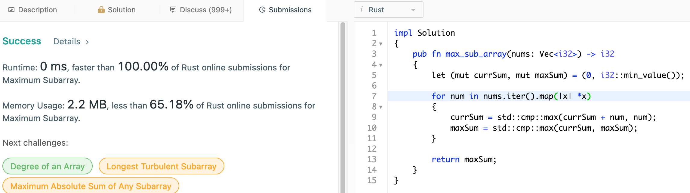
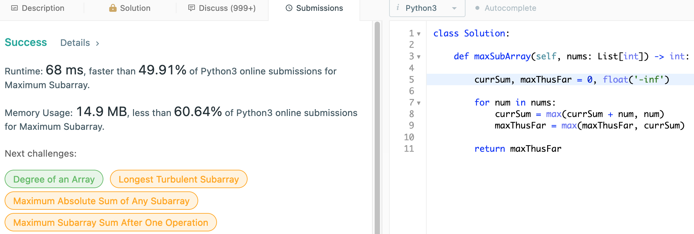

# 53. Maximum Subarray

## Question

Given an integer array nums, find the contiguous subarray (containing at least one number) which has the largest sum and return its sum.

## Approach

We simply iterate along while try to compute the current contiguous subarray sum. As we consider new element, we check to see that whether including the last element does indeed increase our current on-going sum of the contiguous subarray. Otherwise, we break and update our contiguous subarray to start from the new element which is found to be greater. Amongst all the contiguous subarray found this way, we maintain the absolute maximum. O(n) in time complexity.

## Implementation

Rust:

```rust
impl Solution 
{
    pub fn max_sub_array(nums: Vec<i32>) -> i32 
    {
        let (mut currSum, mut maxSum) = (0, i32::min_value());
        
        for num in nums.iter().map(|x| *x)
        {
            currSum = std::cmp::max(currSum + num, num);
            maxSum = std::cmp::max(currSum, maxSum);
        }
        
        return maxSum;
    }
}
```



Python3:

```python
class Solution:
    
    def maxSubArray(self, nums: List[int]) -> int:
        
        currSum, maxThusFar = 0, float('-inf')
        
        for num in nums:
            currSum = max(currSum + num, num)
            maxThusFar = max(maxThusFar, currSum)
        
        return maxThusFar
```


