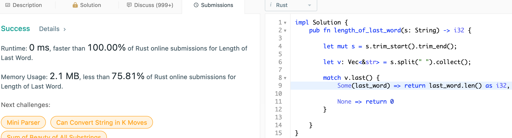
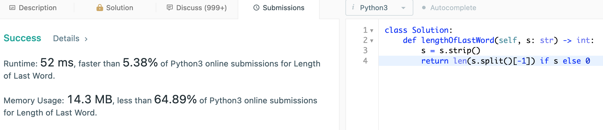

# 58. Length of Last Word

## Question

Given a string s consists of some words separated by spaces, return the length of the last word in the string. If the last word does not exist, return 0.

A word is a maximal substring consisting of non-space characters only.

## Approach

Clean up the given string to remove as much white space from the string on either end. Split the given array by the spaces - to identify the words and find the length of the last of such word.

## Implementation

Rust:

```rust
impl Solution 
{
    pub fn length_of_last_word(s: String) -> i32 
    {
        let mut s = s.trim_start().trim_end();
        let v: Vec<&str> = s.split(" ").collect();
        
        match v.last() 
        {
            Some(last_word) => return last_word.len() as i32,
            None => return 0
        }
    }
}
```



Python3:

```python
class Solution:
    def lengthOfLastWord(self, s: str) -> int:
        s = s.strip()
        return len(s.split()[-1]) if s else 0
```


