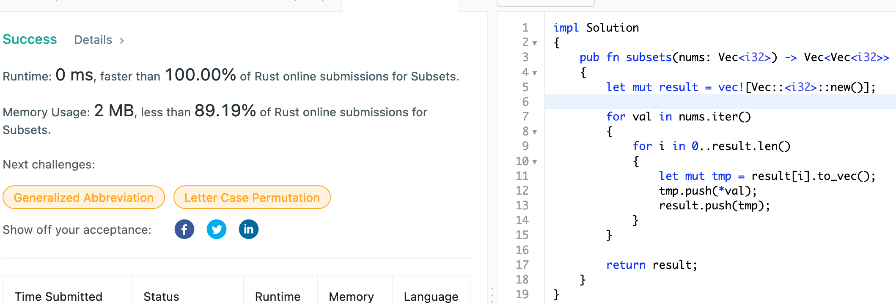

# 78. Subsets

Given an integer array nums of unique elements, return all possible subsets (the power set).

The solution set must not contain duplicate subsets. Return the solution in any order.

## Approach

Starting from the empty set, we continously iterate on the sets that we have been creating thus far and add current value to the sets whilst also creating a new set containing just the new value. The time and space complexity is bounded by the size of the power-set that we are to generate which is O(2^n) where n is the number of unique elements.

## Implementation

Rust:

```rust
impl Solution 
{
    pub fn subsets(nums: Vec<i32>) -> Vec<Vec<i32>> 
    {
        let mut result = vec![Vec::<i32>::new()];

        for val in nums.iter()
        {
            for i in 0..result.len() 
            {
                let mut tmp = result[i].to_vec();
                tmp.push(*val);
                result.push(tmp);
            }
        }
        
        return result;
    }
}
```


