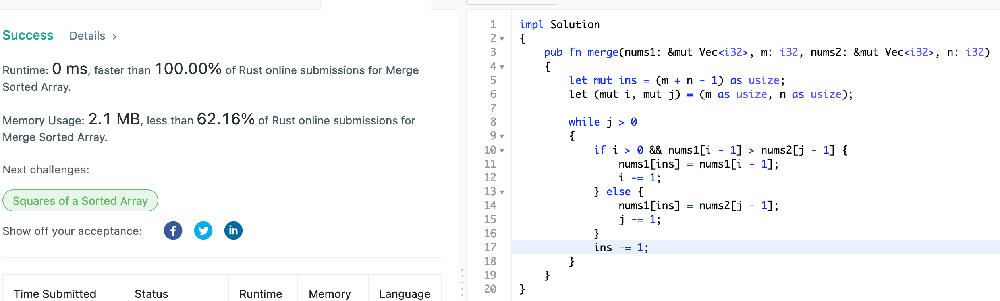

# 88. Merge Sorted Array

## Question

You are given two integer arrays nums1 and nums2, sorted in non-decreasing order, and two integers m and n, representing the number of elements in nums1 and nums2 respectively.

Merge nums1 and nums2 into a single array sorted in non-decreasing order.

The final sorted array should not be returned by the function, but instead be stored inside the array nums1. To accommodate this, nums1 has a length of m + n, where the first m elements denote the elements that should be merged, and the last n elements are set to 0 and should be ignored. nums2 has a length of n.

## Approach

The key point here is that we want to do this in-place - and it specifies that `nums1` would have enough space to hold the data from both of the arrays. Simplest approach would be here to iterate from either end of the two arrays, compare the last values and start inserting whichever is greater until we exhaust all the values. O(n + m) in time complexity.

## Implementation

Rust:

```rust
impl Solution 
{
    pub fn merge(nums1: &mut Vec<i32>, m: i32, nums2: &mut Vec<i32>, n: i32) 
    {
        let (mut ins, mut i, mut j) = ((m + n - 1) as usize, m as usize, n as usize);
        
        while j > 0
        {
            if i > 0 && nums1[i - 1] > nums2[j - 1] {
                nums1[ins] = nums1[i - 1];
                i -= 1;
            } else {
                nums1[ins] = nums2[j - 1];
                j -= 1;
            }
            ins -= 1;
        }
    }
}
```


