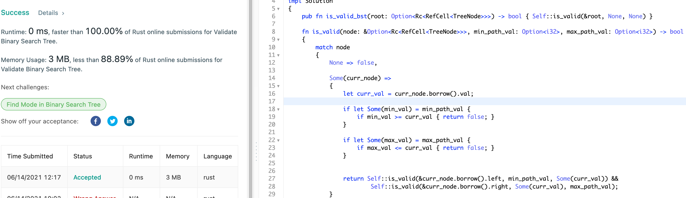
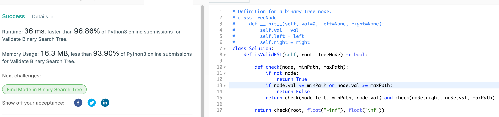

# 98. Validate Binary Search Tree

## Question:

Given the root of a binary tree, determine if it is a valid binary search tree (BST).

A valid BST is defined as follows:

    The left subtree of a node contains only nodes with keys less than the node's key.
    The right subtree of a node contains only nodes with keys greater than the node's key.
    Both the left and right subtrees must also be binary search trees.

## Approach:

One method for checking to see the validity of the given binary search tree would be to perform inorder traversal on the tree and see whether we have a ordered values. By the definition of the BST, inorder traversal should gurantee imposed ascending order of the values. We could spend O(n) space complexity to record the data - but we may also use a single variable to keep track of the previous value that was in order.

Another method would be to use recursion - and check for each node that we visit, the node's value is within the bounds of the defined as per its parent and ancestors. Note that we have to not only consider the direct parent, but also all the minimum and maximum values of the ancestors which sets the bound for the current node that we are visiting.

Either case, we can complete this in O(n) in time complexity.

## Implementation:

Rust:

```rust
use std::rc::Rc;
use std::cell::RefCell;

impl Solution 
{
    pub fn is_valid_bst(root: Option<Rc<RefCell<TreeNode>>>) -> bool { Self::is_valid(&root, None, None) }
    
    fn is_valid(node: &Option<Rc<RefCell<TreeNode>>>, min_path_val: Option<i32>, max_path_val: Option<i32>) -> bool 
    {
        match node 
        {
            None => false,
            
            Some(curr_node) => 
            {
                let curr_val = curr_node.borrow().val;
                
                if let Some(min_val) = min_path_val {
                    if min_val >= curr_val { return false; }
                }
                
                if let Some(max_val) = max_path_val {
                    if max_val <= curr_val { return false; }
                }
                
                
                return Self::is_valid(&curr_node.borrow().left, min_path_val, Some(curr_val)) && 
                        Self::is_valid(&curr_node.borrow().right, Some(curr_val), max_path_val);           
            }
        };
        
        true
    }
}
```



Python3:

```python
# Definition for a binary tree node.
# class TreeNode:
#     def __init__(self, val=0, left=None, right=None):
#         self.val = val
#         self.left = left
#         self.right = right
class Solution:
    def isValidBST(self, root: TreeNode) -> bool:
        
        def check(node, minPath, maxPath):
            if not node:
                return True
            if node.val <= minPath or node.val >= maxPath:
                return False
            return check(node.left, minPath, node.val) and check(node.right, node.val, maxPath)
        
        return check(root, float("-inf"), float("inf"))
```


