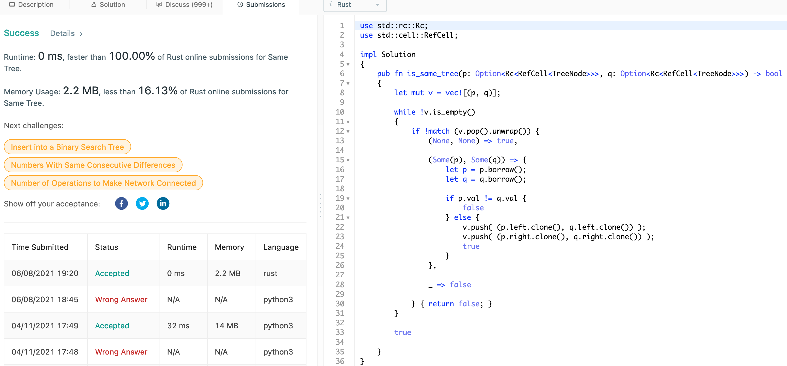
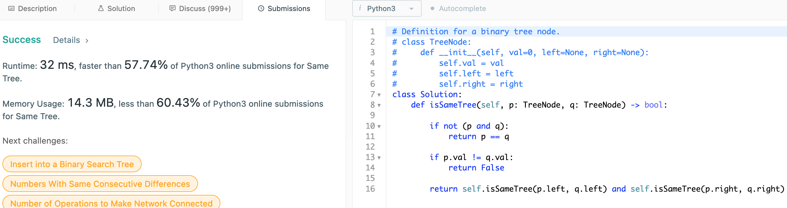

# 100. Same Tree

## Question

Given the roots of two binary trees p and q, write a function to check if they are the same or not.

Two binary trees are considered the same if they are structurally identical, and the nodes have the same value.

## Approach

We can check for whether two trees are equal by iterating on the tree, and check whether their current nodes have same values.

There are two ways to implement this: recursively or iteratively. Either case, O(v + e) in time complexity where v is the number of verticies and e is the number of edges to traverse.

## Implementation

Rust:

```rust
use std::rc::Rc;
use std::cell::RefCell;

impl Solution 
{
    pub fn is_same_tree(p: Option<Rc<RefCell<TreeNode>>>, q: Option<Rc<RefCell<TreeNode>>>) -> bool 
    {
        let mut v = vec![(p, q)];
        
        while !v.is_empty()
        {
            if !match (v.pop().unwrap()) { 
                (None, None) => true,
                
                (Some(p), Some(q)) => {
                    let p = p.borrow();
                    let q = q.borrow();
                    
                    if p.val != q.val {
                        false
                    } else {
                        v.push( (p.left.clone(), q.left.clone()) );
                        v.push( (p.right.clone(), q.right.clone()) );
                        true
                    }
                },
                
                _ => false
                
            } { return false; }
        }
        
        true
        
    }
}
```



Python3:

```python

class Solution:

    def isSameTreeRecur(self, p, q):
        
        # if either p or q is present, then both should not be
        if not (p and q):
            return p == q
        
        if p.val != q.val:
            return False

        return self.isSameTreeRecur(p.left, q.left) and self.isSameTreeRecur(p.right, q.right)

    def isSameTreeIter(self, p, q):

        q = [(p, q)]
        
        def isSame(p, q):
            return p == q if not (p and q) else p.val == q.val

        while q:

            p, q = q.pop()

            if not isSame(p, q):
                return False

            if p:
                q.append( (p.left, q.left) )
                q.append( (p.right, q.right) )
        
        return True
```


